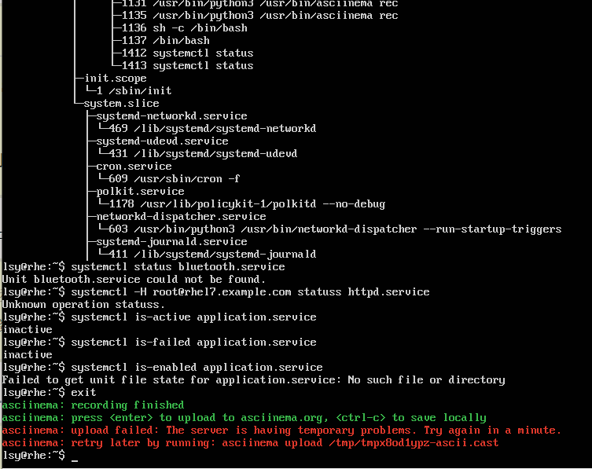
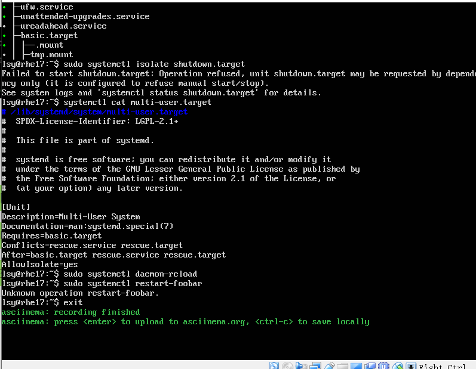

# 第三章：(实验)
## 实验准备
Ubuntu 18.04.4 server 64bit
asciinema用于录屏
## 录屏（有问题）

### 这个录屏我整理了两次，第一次是一直不出现网址，我用Ctrl+c退出了，第二次我的用户名好像被改变了，然后录屏也是不成功，出现了上面那种情况，我就把截屏截了下来，这个问题还没解决。

## 自查清单
### 1.如何添加一个用户并重新实现sudo执行程序权限？
  使用命令 sudo adduser XXX 添加用户
  使用命令 sudo usermod -a ABC -G sudo 将用户"ABC"加入"sudo用户组"

### 2.如何将一个用户添加到一个用户组？
  使用命令 sudo adduser [username] [teamname] 或者命令 sudo usermod -a [username] -G [teamname] 均可

### 3.如何查看当前系统的分区表和文件系统详细信息？
  见下：
  命令                   功能
  sudo sfdisk -l     列出设备分区 
  lsblk -a           仅查看硬盘分区 
  df -ah             列出所有文件列表 
  stat -f            查看文件所在的文件系统信息 

### 4.如何实现开机自动挂载Virtualbox的共享目录分区？
  (1)在Virtualbox的共享文件夹中添加本地文件，重置自动挂载和固定分配
  (2)使用命令 sudo mount /dev/sr0 /media/cdrom 将sr0挂载到目录/media/cdrom里面
  (3)使用命令 sudo apt-get install XXX 安装配置gcc,make,perl和dkms。
  (4)使用命令 sudo /media/cdrom/./VBoxLinuxAdditions.run 和reboot 安装增强功能并重启
  (5)使用命令 lsmod | grep vboxsf 检验是否安装成功
  (6)使用命令 sudo mkdir /mnt/share 创建共享目录
  (7)使用命令 sudo mount -t vboxsf zhangqx-ubuntu-1804 /mnt/shard 将本地文件夹挂载到指定目录

### 5.基于LVM（逻辑分卷管理）的分区如何实现动态扩容和缩减容量？
  lvreduce -L -size /dev/dir   逻辑分卷缩减容量 
  lvextend -L -size /dev/dir   逻辑分卷扩大容量 

### 6.如何通过systemd设置实现在网络连通时运行一个指定脚本，在网络断开时运行另一个脚本？
  (1)使用命令 vim /usr/lib/systemd/system/systemd-network.service 编辑网络联通相关的Unit
  在其中添加内容：
  ExecStartPost=[MY_START_SCRIPT_PATH]
  ExecStopPost=[MY_STOP_SCRIPT_PATH]
  (2)并使用命令 sudo systemctl daemon-reload 重新加载配置文件
  (3)使用命令 sudo systemctl restart systemd-network.service 重启服务
  (4)使用命令 sudo systemctl stop systemd-network.service 关闭服务

### 7.如何通过systemd设置实现一个脚本在任何情况下被杀死之后会立即重新启动？实现杀不死？
  (1)使用命令 vim /lib/systemd/system/KILLME.service 创建并编辑一个脚本配置文件，按i输入一下内容：
  [Unit]
  Description=KILL ME PLEASE
  [Service]
  Type=simple
  ExecStart=MY_SCRIPT_PATH
  ExecStopPost=MY_SCRIPT_PATH
  Restart=always
  RestartSec=1
  RemainAfterExit=yes

  [Install]
  WantedBy=multi-user.target
  (2)然后使用命令 sudo systemctl daemon-reload 重新加载配置文件
  (3)使用命令 sudo systemctl restart KILLME.service 重启KILLME服务
  (4)使用命令 sudo systemctl is-active KILLME.service 查询服务状态是否为active
  (5)使用命令 sudo systemctl kill KILLME.service 尝试杀死服务
  (6)使用命令 sudo systemctl is-active KILLME.service 查询服务状态是否为active来验证服务能否杀死
  (7)使用 reboot 命令重启，但是由于服务无法杀死而重启困难