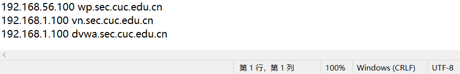
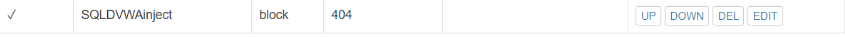

# 第五章：(实验)

## 实验准备
  Ubuntu18.04.4 server 64bit
  Nginx
  VeryNginx
  WordPress-4.7
  DVWA v1.9

## 实验过程

### 在宿主机配置hosts文件


### 安装并启动nginx

使用指令```sudo apt install nginx```安装nginx

使用指令```sudo systemctl start nginx```启动nginx服务


### 安装并启动VeryNginx

使用指令```git clone https://github.com/alexazhou/VeryNginx.git```从github下载原码
```
cd VerNginx
sudo apt install libpcre3-dev libssl1.0-dev zlib1g build-essential unzip gcc make
#安装依赖包
sudo python install.py verynginx
#安装verynginx
```

使用指令```sudo vim /opt/verynginx/openrestyt/nginx/conf/nginx.conf```编辑配置文件，将user的值改为```www-data```，将监听端口改为```8080```

使用指令```sudo chmod -R 777 /opt/verynginx/comnfigs```修改权限

访问openresty


### 安装MYSQL,PHP
使用指令```sudo apt install mysql-server```安装mysql，使用指令```sudo mysql_installation```启动安全脚本，将密码设为root用户的密码

使用指令```sudo apt install php-fpm php-mysql```安装PHP-fpm模块以及附加包

#### 创建数据库并安装其他PHP安装包
```
sudo mysql
mysql>CREATE DATABASE wordpress DEFAULT CHARACTER SET utf8_unicode_ci;
mysql>GRANT ALL ON wordpress.* TO 'wordpressuser'@'localhost' IDENTIFIED BY 'password';
mysql>FLUSH PRIVILEGES;
mysql>exit;
```
使用指令```sudo apt install php-curl php-gd php-intl php-mbstring php-soap php-xml php-xmlrpc php-zip```添加PHP的相关扩展包，并使用指令```sudo systemctl restart php7.2-fpm```重启进程

### 下载并配置WordPress
```
cd /tmp
sudo wget https://github.com/WordPress/WordPress/archive/4.7.zip
unzip 4.7.zip
cp /tmp/WordPress/wp-config-sample.php /tmp/WordPress/wp-config.php
sudo mkdir /var/www/html/wp.sec.cuc.edu.cn
sudo cp -ar /tmp/WordPress/. /var/www/html/wp.sec.cuc.edu.cn
sudo chown -R www-data /var/www/html/wp.sec.edu.cn
```
### 配置nginx
使用指令```sudo vim /etc/nginx/sites-available/wp.sec.cuc.edu.cn```编辑以下内容
```
server {
    listen 80 default_server;
    listen [::]:80 default_server;

    root /var/www/html/wp.sec.cuc.edu.cn;
    index index.php index.html index.htm index.nginx-debian.html;
    server_name wp.sec.cuc.edu.cn;

    location / {
        #try_files $uri $uri/ =404;
        try_files $uri $uri/ /index.php$is_args$args;

    }   
    location ~ \.php$ {
        include snippets/fastcgi-php.conf;
        fastcgi_pass unix:/var/run/php/php7.2-fpm.sock;
    }

    location ~ /\.ht {
        deny all
    }
}
```

指令```sudo ln -s /etc/nginx/sites-available/wp.sec.cuc.edu.cn /etc/nginx/sites-enabled```创建链接

指令```sudo unlink /etc/nginx/sites-enabled/default```取消链接

指令```sudo nginx -t```测试配置文件，并使用```sudo systemctl reload nginx```重启服务

配置相关文件
```
curl -s https://api.wordpress.org/sec-key/1.1/salt/
sudo vim /var/www/WordPress/wp-config.php
#使用生成的配置替换
define('DB_NAME','wordpress');
/** MySQL database username */
define('DB_USER','wordpressuser');
/** MySQL database password */
define('DB_PASSWORD','password');

define('FS_METHOD','direct');
```

配置verynginx访问```wp.sec.cuc.edu.cn```


### DVWA
下载DVWA

使用指令```sudo git clone https://github.com/ethicalhack3r/DVWA/tmp/DVWA```下载原码

并使用指令```sudo mkdir /var/www/html/dvwa.sec.cuc.edu.cn```和```sudo cp -r /tmp/DVWA/. /var/www/html/dvwa.sec.cuc.edu.cn```转移到指定目录

创建数据库
```
sudo mysql
mysql> CREATE DATABASE dvwa DEFAULT CHARACTER SET utf8 COLLATE utf8_unicode_ci;
mysql> GRANT ALL ON  dvwa.* TO 'dvwauser'@'localhost' IDENTIFIED BY 'p@ssw0rd';
mysql> FLUSH PRIVILEGES;
mysql> exit;
```
配置PHP
```
sudo cp /var/www/html/dvwa.sec.cuc.edu.cn/config/config.inc.php.dist /var/www/html/dvwa.sec.cuc.edu.cn/config/config.inc.php
sudo vim /var/www/html/DVWA/config/config.inc.php
sudo vim /etc/php/7.2/fpm/php.ini 
```

如下所示修改配置
```
allow_url_include = on 
allow_url_fopen = on
display_errors = off  #Optional
```

使用指令```sudo systemctl restart php7.2-fpm```重启PHP，并使用指令```sudo chown -R www-data.www-data/var/www/html/dvwa.sec.cuc.edu.cn```分配权限

使用指令```sudo vim/etc/nginx/sites-available/dvwa.sec.cuc.edu.cn```编写配置文件，加入以下内容

```
server {
    listen 8008 default_server;
    listen [::]:8008 default_server;

    root /var/www/html/dvwa.sec.cuc.edu.cn;
    index index.php index.html index.htm index.nginx-debian.html;
    server_name dvwa.sec.cuc.edu.cn;

    location / {
        #try_files $uri $uri/ =404;
        try_files $uri $uri/ /index.php$is_args$args;  
    }

    location ~ \.php$ {
        include snippets/fastcgi-php.conf;
        fastcgi_pass unix:/var/run/php/php7.2-fpm.sock;
    }

    location ~ /\.ht {
        deny all
    }
}
```

使用指令```sudo ln -s /etc/nginx/sites-available/wp.sec.cuc.edu.cn/etc/nginx/sites-enabled```重新链接，并使用指令```sudo nginx -t```查看情况，再使用指令```sudo systemctl reload nginx```重启服务

配置verynginx访问```wp.sec.cuc.edu.cn```


### 安全加固
#### 配置使ip地址无法访问站点
添加正则表达式进行匹配，并返回403Code


#### 在不升级Wordpress版本的情况下，通过定制VeryNginx的访问控制策略规则，热修复WordPress < 4.7.1 - Username Enumeration


#### 通过配置VeryNginx的Filter规则实现对Damn Vulnerable Web Application(DVWA)的SQL注入实验在低安全等级条件下进行防护




#### 定制VeryNginx的访问控制策略规则

添加Response和Frequency Limit


实验完成的并不是很成功，有一些没有配置出来。


